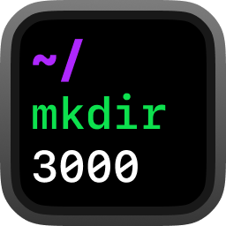
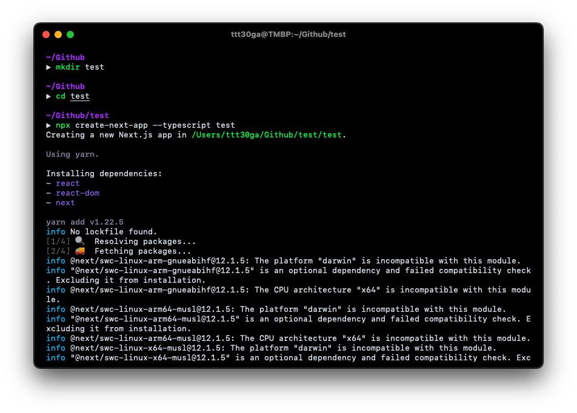
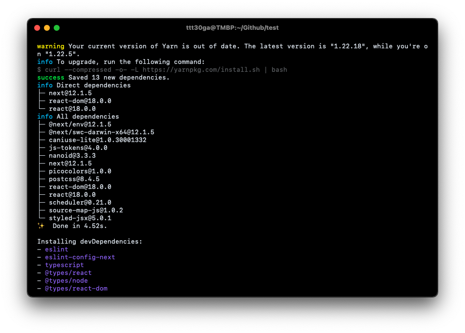
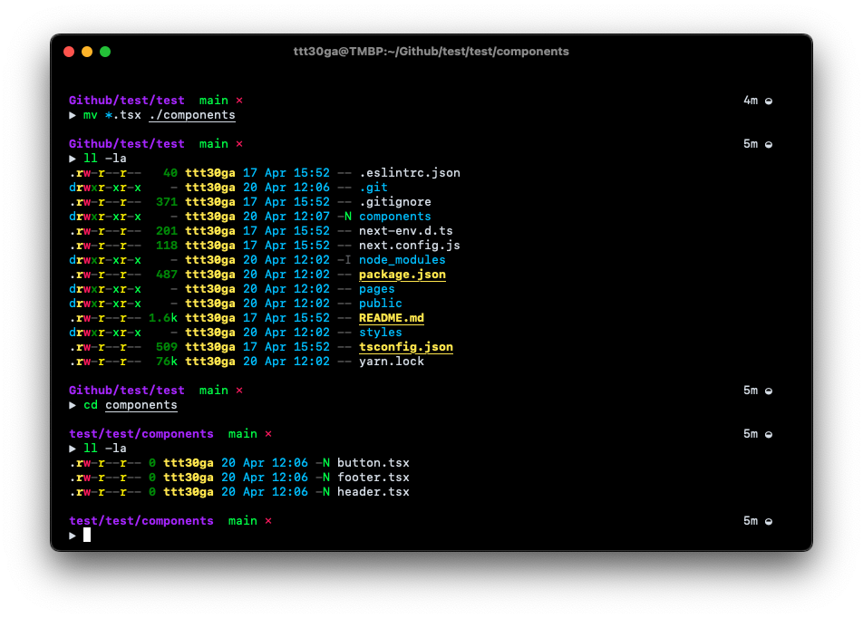
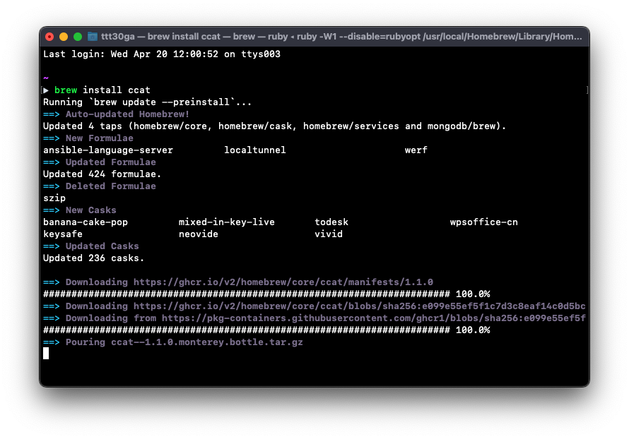
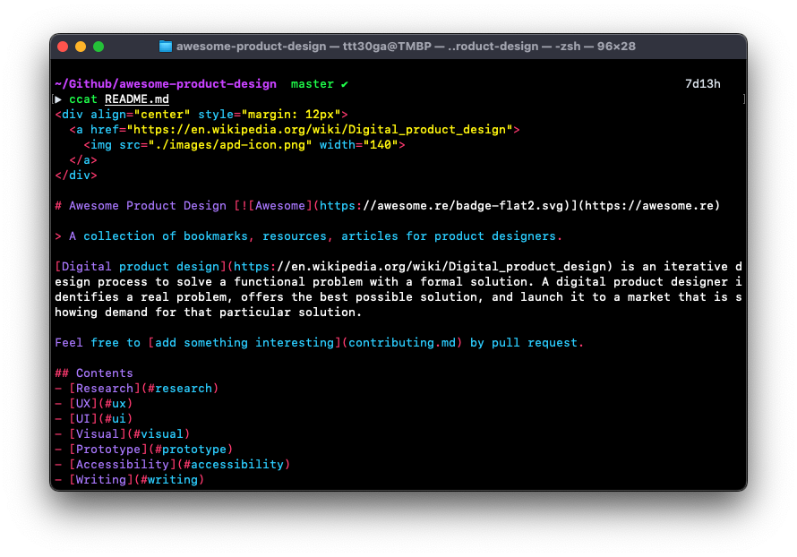
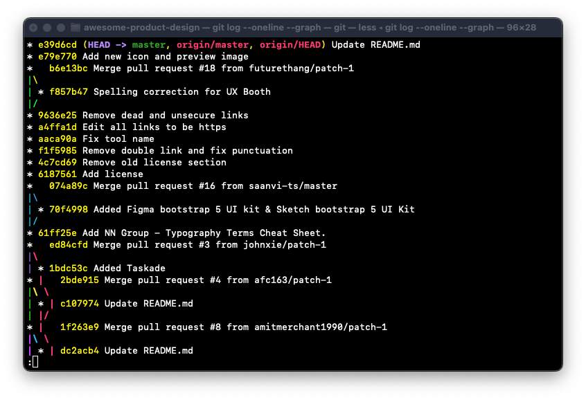

<div align="center" style="margin: 12px">
	
</div>

# mkdir3000
[](https://lbesson.mit-license.org/)

**Dark theme for the Terminal**

`mkdir3000` is a futuristic inspired terminal dark theme.
It uses strong contrast bold colors that makes it easy to scan and spot what's needed.

## Install on iTerm2
```
curl -O https://raw.githubusercontent.com/ttt30ga/mkdir3000/main/mkdir3000.itermcolors
```
- Open `./mkdir3000.itermcolors` or double click on downloaded file
- Open iTerm2 preferences `cmd` + `,`
- Go to `iTerm2 > Preferences > Profiles > Colors`
- Select `mkdir3000`

## Install on Terminal.app
```
curl -O https://raw.githubusercontent.com/ttt30ga/mkdir3000/main/mkdir3000.terminal
```
- open `./mkdir3000.terminal` or double click on downloaded file
- Open Terminal preferences `cmd` + `,`
- Go to `Profile > Text`
- Select `mkdir3000`
- Click `Default`

---

## iTerm2




## Terminal.app




## Author
[ttt30ga](https://www.okaygood.xyz/)

## License
This project is open source and available under the [MIT License](LICENSE).
